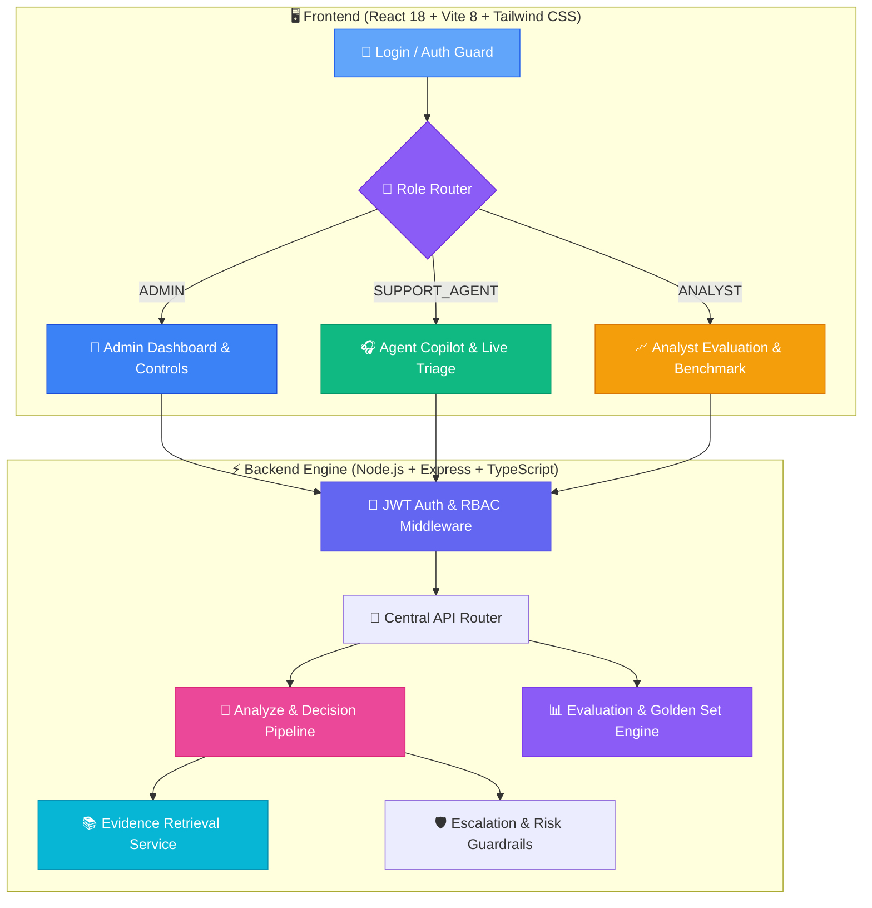

```
███████╗██╗   ██╗██████╗ ██████╗  ██████╗ ██████╗ ████████╗██╗     ███████╗███╗   ██╗███████╗     █████╗ ██╗
██╔════╝██║   ██║██╔══██╗██╔══██╗██╔═══██╗██╔══██╗╚══██╔══╝██║     ██╔════╝████╗  ██║██╔════╝    ██╔══██╗██║
███████╗██║   ██║██████╔╝██████╔╝██║   ██║██████╔╝   ██║   ██║     █████╗  ██╔██╗ ██║███████╗    ███████║██║
╚════██║██║   ██║██╔═══╝ ██╔═══╝ ██║   ██║██╔══██╗   ██║   ██║     ██╔══╝  ██║╚██╗██║╚════██║    ██╔══██║██║
███████║╚██████╔╝██║     ██║     ╚██████╔╝██║  ██║   ██║   ███████╗███████╗██║ ╚████║███████║    ██║  ██║██║
╚══════╝ ╚═════╝ ╚═╝     ╚═╝      ╚═════╝ ╚═╝  ╚═╝   ╚═╝   ╚══════╝╚══════╝╚═╝  ╚═══╝╚══════╝    ╚═╝  ╚═╝╚═╝
```

## SUPPORTLENS AI 🛡️

### Evidence-First Customer Support Copilot & Intelligence Platform

[](https://react.dev)
[](https://vitejs.dev)
[](https://www.typescriptlang.org)
[](https://nodejs.org)
[](https://expressjs.com)
[](https://tailwindcss.com)
[](https://jwt.io)
[](https://github.com/HareshK-14/hiver)

> An **Evidence-First AI Customer Support Copilot** that safely understands customer inquiries, learns from brand-specific historical behavior, retrieves ground-truth evidence, generates grounded replies, governs autonomous actions, and provides measurable proof of trust.
>
> *SupportLens AI — PROOF > COMPLEXITY · EVIDENCE > MARKETING · TRUST > AUTOMATION*

[🚀 Quick Start](#-quick-start) · [👥 Multi-Role Platform](#-multi-role-platform) · [🏗️ Architecture](#%EF%B8%8F-architecture) · [🛡️ Safety & Confidence](#%EF%B8%8F-safety--confidence-engine) · [📡 API Endpoints](#-api-endpoints) · [🎨 Design System](#-design-system)

---

## 📑 Table of Contents

| Core Sections | Technical Deep Dives | Resources |
|---|---|---|
| [🎯 Key Features](#-key-features) | [🏗️ Architecture](#%EF%B8%8F-architecture) | [🚀 Quick Start](#-quick-start) |
| [🆚 Why SupportLens AI?](#-why-supportlens-ai) | [🔀 Evidence-First Pipeline](#-evidence-first-pipeline) | [🔑 Demo Accounts & Credentials](#-demo-accounts--credentials) |
| [👥 Multi-Role Platform (3 Roles)](#-multi-role-platform) | [🛡️ Safety & Confidence Engine](#%EF%B8%8F-safety--confidence-engine) | [⚙️ Environment Variables](#%EF%B8%8F-environment-variables) |
| [🎨 Design System (Light Aurora)](#-design-system) | [📡 API Endpoints](#-api-endpoints) | [🗺️ Roadmap & Verification](#%EF%B8%8F-roadmap--verification) |
| [🏆 Built With](#-built-with) | [📊 Evaluation Framework](#-evaluation-framework) | [👤 Author](#-author) |

---

## 🎯 Key Features

| Feature | Description |
|---|---|
| 🛡️ **Evidence-First Copilot** | Every AI suggestion is strictly grounded in retrieved brand support knowledge and verified past resolutions — zero hallucinations. |
| 👥 **Three-Role Operating System** | Purpose-built dashboards and workflows for **Admin**, **Support Agent**, and **AI Analyst** with role-based routing. |
| 🚦 **Confidence & Risk Guardrails** | Multi-threshold policy governing three clear actions: **AUTO_HANDLE**, **SUGGEST_TO_AGENT**, or **ESCALATE_TO_HUMAN**. |
| 📊 **First-Class Evaluation Suite** | Real-time benchmarks for Intent Macro-F1, groundedness scoring, hallucination rate, and false-automation risk tracking. |
| 🎯 **Golden Set Benchmark** | Curated edge-case evaluation dataset ensuring high recall and safety against complex and adversarial customer tickets. |
| 📜 **Brand Knowledge Retrieval** | Semantic and lexical retrieval engine indexing past support tickets, policies, and response templates. |
| 🌌 **Light Aurora Glassmorphic UI** | Premium enterprise visual theme with frosted ice glass cards, smooth glow accents, and responsive layout. |

---

## 🆚 Why SupportLens AI?

| Capability | Generic AI Chatbot / Support Tool | **SupportLens AI** |
|---|---|---|
| **Hallucination Control** | Black-box LLM text generation with high risk of fabricated policies | 🛡️ **Strict Evidence Citations** with verifiable source text verification |
| **Automation Governance** | Blind auto-replies or rigid keyword rules | 🚦 **Multi-Threshold Decision Matrix** with sentiment & risk detection |
| **Evaluation & Trust** | Anecdotal "vibe checks" without statistical backing | 📊 **First-Class Metrics Dashboard** (Macro-F1, Groundedness %, False Auto-Rate) |
| **User Experience** | Single generic chat screen for all users | 👥 **3 Distinct Role Experiences** (Admin Governance, Agent Copilot, Analyst Quality) |
| **Ground Truth** | Untracked prompt drift over time | 🎯 **Versioned Golden Set** for continuous regression benchmarking |
| **Design & Ergonomics** | Dark/generic plain admin templates | 🌌 **Light Aurora Theme** with frosted glassmorphism & accessible contrast |

---

## 🏗️ Architecture



### 📁 Project Structure

```
hiver/
├── README.md                      Top-level repository documentation
├── .gitignore                     Clean Git exclusions (zero secrets/cache)
└── supportlens-ai/                Core SupportLens AI Application
    ├── frontend/                  React 18 + Vite + TypeScript Client
    │   ├── src/
    │   │   ├── components/        Layout (Sidebar, TopBar), Auth Guards, UI Cards
    │   │   ├── context/           AuthContext (RBAC) & ThemeContext
    │   │   ├── pages/             15+ views (Admin, Agent, Analyst, Evidence, etc.)
    │   │   ├── services/          Axios API service layer
    │   │   └── types/             Full TypeScript data contracts & schemas
    │   └── package.json
    ├── backend/                   Node.js + Express + TypeScript API Server
    │   ├── src/
    │   │   ├── middleware/        JWT auth, error handler, request logger
    │   │   ├── routes/            Admin, Agent, Analyst, Analyze, Eval routes
    │   │   ├── server.ts          HTTP application bootstrap
    │   │   └── app.ts             Express route orchestration
    │   ├── tests/                 Jest test suites for RBAC & health
    │   └── package.json
    ├── configs/                   System configurations & intent definitions
    ├── reports/                   Architectural decision log & benchmark reports
    └── scripts/                   Dataset ingestion & preparation scripts
```

---

## 🔀 Evidence-First Pipeline

```
┌─────────────────────────────────────────────────────────────────┐
│                    📩 INCOMING CUSTOMER MESSAGE                 │
│        "Where is order #9421? It was promised 2 days ago!"      │
└────────────────────────────┬────────────────────────────────────┘
                             │
          ╔══════════════════▼═══════════════════════════════════╗
          ║      🔐  AUTH & ROLE VERIFICATION                     ║
          ║            JWT Auth + Role Context Validation         ║
          ╚══════════════════╤═══════════════════════════════════╝
                          │
          ╔══════════════════▼═══════════════════════════════════╗
          ║      🧠  INTENT & SENTIMENT ANALYSIS                  ║
          ║          Intent: ORDER_TRACKING (Confidence: 0.94)    ║
          ║          Sentiment: NEGATIVE / FRUSTRATED             ║
          ╚══════════════════╤═══════════════════════════════════╝
                          │
          ╔══════════════════▼═══════════════════════════════════╗
          ║      📚  BRAND EVIDENCE RETRIEVAL                     ║
          ║          • Shipping Policy v3.2 (Grounding: 0.96)     ║
          ║          • Carrier Delay Advisory (Grounding: 0.89)   ║
          ╚══════════════════╤═══════════════════════════════════╝
                          │
          ╔══════════════════▼═══════════════════════════════════╗
          ║      🚦  CONFIDENCE & SAFETY GATEKEEPER               ║
          ║          Auto-Handle Threshold: 0.85                  ║
          ║          Negative Sentiment Penalty: Applied          ║
          ║          Action: SUGGEST_TO_AGENT (Human in the Loop) ║
          ╚══════════════════╤═══════════════════════════════════╝
                          │
                          ▼
┌─────────────────────────────────────────────────────────────────┐
│              ✅ GROUNDED RESPONSE DELIVERED TO COPILOT           │
│   • Suggested draft citing exact tracking and refund policy     │
│   • Confidence breakdown & cited evidence badges displayed      │
│   • Telemetry logged to Analyst evaluation benchmark            │
└─────────────────────────────────────────────────────────────────┘
```

---

## 👥 Multi-Role Platform

SupportLens AI delivers **three separate, deeply tailored dashboard experiences**:

### 👑 1. Admin Dashboard (`/admin/dashboard`)
* **System Operations Overview**: Total conversations, automated handling rate, escalation breakdown, and uptime metrics.
* **Confidence & Risk Thresholds**: Dynamic controls for Auto-Handle min confidence (`0.85`), Human Review floor (`0.65`), and Risk Multiplier.
* **Role Access Management**: Full team visibility across Admin, Agent, and Analyst seats with quick status indicators.
* **Live Service Telemetry**: Real-time status for AI Inference Engine, Evidence Index, and Golden Benchmark.

### 🎧 2. Support Agent Copilot (`/agent/dashboard`)
* **Active Queue & Priority Triage**: Fast access to open, unassigned, and escalated customer tickets.
* **Interactive AI Copilot**: Paste or select any message to instantly generate grounded resolution drafts.
* **Evidence Source Inspector**: Inspect exact policy references, previous agent replies, and grounding scores.
* **1-Click Review & Insert**: Review AI suggestions, edit in real-time, or trigger immediate human escalation.

### 📈 3. AI Analyst & Quality Dashboard (`/analyst/dashboard`)
* **Model Benchmark Telemetry**: Macro-F1 score, Hallucination Rate, Groundedness %, and False Auto-Handle Rate.
* **Intent Performance Heatmap**: Per-intent precision, recall, and sample distribution table.
* **Golden Set Ground Truth**: Versioned evaluation suite measuring system regression against tricky edge cases.
* **Automated Failure Signals**: Automated flags for low-confidence clusters, negative sentiment spikes, and coverage gaps.

---

## 🛡️ Safety & Confidence Engine

### Decision Policy Formula

```
Safe Auto-Handle Trigger = 
    (Intent Confidence ≥ 0.85) ∧ 
    (Evidence Groundedness ≥ 0.90) ∧ 
    (Sentiment ≠ HIGHLY_NEGATIVE) ∧ 
    (Risk Category ≠ FINANCIAL_OR_LEGAL)
```

| Decision Outcome | Condition | System Behavior |
|---|---|---|
| **AUTO_HANDLE** | High Confidence + High Groundedness + Low Risk | Generates and sends safe verified response automatically |
| **SUGGEST_TO_AGENT** | Medium Confidence OR Elevated Sentiment | Drafts reply with evidence chips for agent approval |
| **ESCALATE_TO_HUMAN** | Low Confidence OR Policy Exception OR Angry Customer | Instantly transfers ticket to senior human agent queue |

---

## 🎨 Design System

| Aspect | Implementation |
|---|---|
| **Theme** | Light Aurora / Ice Lavender Glassmorphism |
| **Base Canvas** | Multi-stop cool gradient (`#F8FAFC` → `#EFF6FF` → `#FAF5FF`) |
| **Card Styling** | Semi-transparent white backdrop (`bg-white/70 backdrop-blur-xl border-white/60`) |
| **Primary Accents** | Blue (`#3B82F6`) · Purple (`#8B5CF6`) · Emerald (`#10B981`) · Amber (`#F59E0B`) |
| **Typography** | Inter (sans-serif) · JetBrains Mono (code & metrics) |
| **Role Colors** | Admin (Blue) · Support Agent (Emerald) · Analyst (Amber/Violet) |

---

## 📡 API Endpoints

```
# Authentication & Identity
POST /api/auth/login                  Authenticate user & issue JWT
GET  /api/auth/me                     Get current authenticated session

# Role-Specific Telemetry
GET  /api/admin/dashboard             Fetch system metrics, services & thresholds
GET  /api/agent/dashboard             Fetch agent queue, active tickets & triage stats
GET  /api/analyst/dashboard           Fetch benchmark metrics & intent distributions

# Core Copilot & Intelligence
POST /api/analyze                     Submit message for intent, evidence & draft reply
GET  /api/conversations               List indexed customer conversations
GET  /api/conversations/:id           Retrieve conversation timeline & metadata
GET  /api/evidence?q=:query           Query semantic evidence knowledge base
GET  /api/decisions                   Audit trail of automated vs suggested actions
GET  /api/escalations                 List human-escalated cases with reason codes

# Quality & Evaluation Benchmarks
GET  /api/evaluation/summary          High-level F1, Groundedness & False Auto rates
GET  /api/evaluation/baselines        Comparative baseline model comparisons
GET  /api/golden-set                  Curated golden test benchmark set
GET  /api/health                      System uptime & component health check
```

---

## 🔑 Demo Accounts & Credentials

| Role | Email | Password | Landing Route | Focus Area |
|---|---|---|---|---|
| **ADMIN** | `admin@supportlens.ai` | `admin123` | `/admin/dashboard` | System governance, telemetry & thresholds |
| **SUPPORT_AGENT** | `agent@supportlens.ai` | `agent123` | `/agent/dashboard` | Ticket queue, live copilot & 1-click replies |
| **ANALYST** | `analyst@supportlens.ai` | `analyst123` | `/analyst/dashboard` | Model evaluation, golden set & safety metrics |

---

## 🚀 Quick Start

### Prerequisites
* **Node.js**: v18.0+ or v20.0+
* **npm**: v9.0+
* Modern Web Browser (Chrome, Edge, Firefox, Safari)

### 1 · Clone Repository

```bash
git clone https://github.com/HareshK-14/hiver.git
cd hiver
```

### 2 · Start Backend Server

```bash
cd supportlens-ai/backend
npm install
npm run dev
```
> Server starts on `http://localhost:3001` with active health check at `/api/health`.

### 3 · Start Frontend Client (in a separate terminal)

```bash
cd supportlens-ai/frontend
npm install
npm run dev
```
> Client launches on `http://localhost:5173`. Open in your browser and sign in using any of the [Demo Accounts](#-demo-accounts--credentials).

---

## ⚙️ Environment Variables

**`supportlens-ai/backend/.env`**
```env
PORT=3001
JWT_SECRET=supportlens_jwt_secret_dev_key_2026
CORS_ORIGIN=http://localhost:5173
NODE_ENV=development
```

**`supportlens-ai/frontend/.env`**
```env
VITE_API_URL=http://localhost:3001
```

> ⚠️ All `.env` files are ignored by version control to ensure credentials are never committed.

---

## 🗺️ Roadmap & Verification

| Stage | Status | Description |
|---|---|---|
| 1 | ✅ Done | Project structure, TypeScript configs & Express scaffold |
| 2 | ✅ Done | Role-Based Access Control (RBAC) middleware & JWT token authentication |
| 3 | ✅ Done | Evidence-First Copilot API contracts and stub routes |
| 4 | ✅ Done | Light Aurora glassmorphism design system & component library |
| 5 | ✅ Done | 3 distinct role dashboards: Admin, Support Agent, and AI Analyst |
| 6 | ✅ Done | Interactive live navigation across all KPI cards, service rows & quick actions |
| 7 | ✅ Done | Jest backend test suites covering RBAC and health endpoints |
| 8 | 🔲 In Progress | Full local embedding vector index generation using brand support corpus |
| 9 | 🔲 Planned | Real-time WebSocket ticket updates for multi-agent triage |
| 10 | 🔲 Planned | Exportable compliance audit log (PDF & CSV) for governance teams |

---

## 🏆 Built With

| Layer | Technology |
|---|---|
| **Frontend UI** | React 18, Vite 8, TypeScript, Tailwind CSS, Lucide React |
| **Backend API** | Node.js, Express 4, TypeScript, ts-node-dev |
| **Security & Auth** | JSON Web Tokens (JWT), Role-Based Access Control (RBAC) |
| **Testing** | Jest, Supertest, ts-jest |
| **Data & Retrieval** | Python 3 data preparation & semantic indexing pipeline |

---

## 👤 Author

**Haresh K.**  
*B.Tech Information Technology, V.S.B. Engineering College*  
* [GitHub Profile](https://github.com/HareshK-14)  
* [Hiver SDE Assignment Repository](https://github.com/HareshK-14/hiver)

---

### ⭐ Star this repository if you find this architecture valuable!

*SupportLens AI — Turning customer support data into grounded intelligence and verified trust.*
